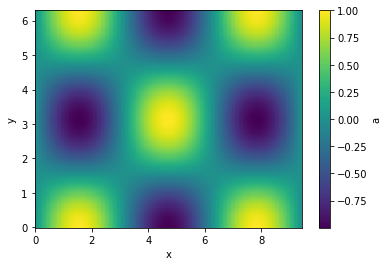
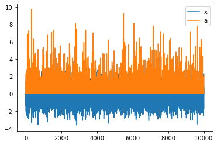
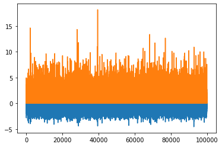
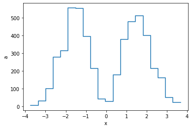
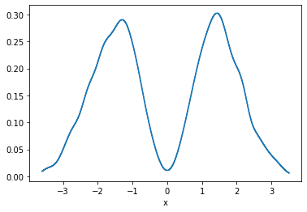
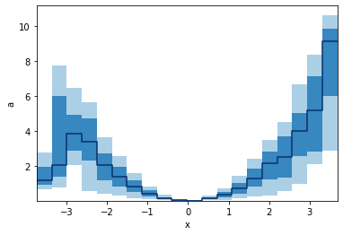

# Dragoman


> A dragoman was an interpreter, translator, and official guide between Turkish, Arabic, and Persian-speaking countries and polities of the Middle East and European embassies, consulates, vice-consulates and trading posts. A dragoman had to have a knowledge of Arabic, Persian, Turkish, and European languages. (Source: wikipedia)

Similarly, the dragoman python library guides you through your data and translates between different representations.
Its aim is to offer a consistant and pythonic way to handle different datasaets and translations between them.
A dataset can for instance be simple colum/row data, or it can be data on a grid.

One of the key features of dragoman is the seamless translation from one data represenation into any other. 
Convenience `pyplot` plotting functions are also available, in order to produce standard plots without any hassle.

## Installation

* `git clone git@github.com:philippeller/dragoman.git`
* `pip install dragoman`

## Simple Examples


```python
import numpy as np
import dragoman as dm
```

### Grid Data

GridData is a collection of individual GridArrays. Both have a defined grid, here we initialize the grid in the constructor through simple keyword arguments resulting in a 2d grid with axes `x` and `y`


```python
g = dm.GridData(x = np.linspace(0,3*np.pi, 30),
                y = np.linspace(0,2*np.pi, 20),
               )
```

Filling one array with some sinusoidal functions, called `a` here


```python
g['a'] = np.sin(g['x']) * np.cos(g['y'])
```

in 1-d and 2-d they render as html in jupyter notebooks


```python
g['a']
```


<table>
<tbody>
<tr><td><b>y \ x</b></td><td><b>0</b></td><td><b>0.325</b></td><td><b>0.65</b></td><td>...</td><td><b>8.77</b></td><td><b>9.1</b></td><td><b>9.42</b></td></tr>
<tr><td><b>0</b>    </td><td>0       </td><td>0.319       </td><td>0.605      </td><td>...</td><td>0.605      </td><td>0.319     </td><td>3.67e-16   </td></tr>
<tr><td><b>0.331</b></td><td>0       </td><td>0.302       </td><td>0.572      </td><td>...</td><td>0.572      </td><td>0.302     </td><td>3.47e-16   </td></tr>
<tr><td><b>0.661</b></td><td>0       </td><td>0.252       </td><td>0.478      </td><td>...</td><td>0.478      </td><td>0.252     </td><td>2.9e-16    </td></tr>
<tr><td>...         </td><td>...     </td><td>...         </td><td>...        </td><td>...</td><td>...        </td><td>...       </td><td>...        </td></tr>
<tr><td><b>5.62</b> </td><td>0       </td><td>0.252       </td><td>0.478      </td><td>...</td><td>0.478      </td><td>0.252     </td><td>2.9e-16    </td></tr>
<tr><td><b>5.95</b> </td><td>0       </td><td>0.302       </td><td>0.572      </td><td>...</td><td>0.572      </td><td>0.302     </td><td>3.47e-16   </td></tr>
<tr><td><b>6.28</b> </td><td>0       </td><td>0.319       </td><td>0.605      </td><td>...</td><td>0.605      </td><td>0.319     </td><td>3.67e-16   </td></tr>
</tbody>
</table>


It can be plotted easily in case of 1-d and 2-d grids


```python
g.plot(cbar=True);
```


Let's interpolate the values to 200 points along each axis and plot


```python
g.interp(x=200, y=200).plot(cbar=True);
```





The objects are also numpy compatible and indexable by index (integers) or values (floats). Numpy functions with axis keywords accept either the name of the axis, e.g. here `x` and therefore is independent of axis ordering, or the usual integer indices.


```python
g[10::-1, :np.pi:2]
```


<table>
<tbody>
<tr><td><b>y \ x</b></td><td><b>3.25</b></td><td><b>2.92</b></td><td><b>2.6</b></td><td>...</td><td><b>0.65</b></td><td><b>0.325</b></td><td><b>0</b></td></tr>
<tr><td><b>0</b>    </td><td>a = -0.108 </td><td>a = 0.215  </td><td>a = 0.516 </td><td>...</td><td>a = 0.605  </td><td>a = 0.319   </td><td>a = 0   </td></tr>
<tr><td><b>0.661</b></td><td>a = -0.0853</td><td>a = 0.17   </td><td>a = 0.407 </td><td>...</td><td>a = 0.478  </td><td>a = 0.252   </td><td>a = 0   </td></tr>
<tr><td><b>1.32</b> </td><td>a = -0.0265</td><td>a = 0.0528 </td><td>a = 0.127 </td><td>...</td><td>a = 0.149  </td><td>a = 0.0784  </td><td>a = 0   </td></tr>
<tr><td><b>1.98</b> </td><td>a = 0.0434 </td><td>a = -0.0864</td><td>a = -0.207</td><td>...</td><td>a = -0.243 </td><td>a = -0.128  </td><td>a = -0  </td></tr>
<tr><td><b>2.65</b> </td><td>a = 0.0951 </td><td>a = -0.189 </td><td>a = -0.453</td><td>...</td><td>a = -0.532 </td><td>a = -0.281  </td><td>a = -0  </td></tr>
</tbody>
</table>


```python
np.sum(g[10::-1, :np.pi:2].T, axis='x')
```


<table>
<tbody>
<tr><td><b>y</b></td><td><b>0</b></td><td><b>0.661</b></td><td><b>1.32</b></td><td><b>1.98</b></td><td><b>2.65</b></td></tr>
<tr><td><b>a</b></td><td>6.03    </td><td>4.76        </td><td>1.48       </td><td>-2.42      </td><td>-5.3       </td></tr>
</tbody>
</table>


### Comparison
As comparison to point out the convenience, an alternative way without using Dragoman to achieve the above would look something like the follwoing:


```python
x = np.linspace(0,3*np.pi, 30)
y = np.linspace(0,2*np.pi, 20) 

xx, yy = np.meshgrid(x, y)

a = np.sin(xx) * np.cos(yy)

import matplotlib.pyplot as plt

x_widths = np.diff(x)
x_pixel_boundaries = np.concatenate([[x[0] - 0.5*x_widths[0]], x[:-1] + 0.5*x_widths, [x[-1] + 0.5*x_widths[-1]]])
y_widths = np.diff(y)
y_pixel_boundaries = np.concatenate([[y[0] - 0.5*y_widths[0]], y[:-1] + 0.5*y_widths, [y[-1] + 0.5*y_widths[-1]]])

pc = plt.pcolormesh(x_pixel_boundaries, y_pixel_boundaries, a)
plt.gca().set_xlabel('x')
plt.gca().set_ylabel('y')
cb = plt.colorbar(pc)
cb.set_label('a')
```


```python
from scipy.interpolate import griddata

interp_x = np.linspace(0,3*np.pi, 200)
interp_y = np.linspace(0,2*np.pi, 200) 

grid_x, grid_y = np.meshgrid(interp_x, interp_y)

points = np.vstack([xx.flatten(), yy.flatten()]).T
values = a.flatten()

interp_a = griddata(points, values, (grid_x, grid_y), method='cubic')
```

### PointData

Another representation of data is `PointData`, which is not any different of a dictionary holding same-length nd-arrays or a pandas `DataFrame` (And can actually be instantiated with those)


```python
p = dm.PointData()
p['x'] = np.random.randn(10000)
p['a'] = np.random.rand(p.size) * p['x']**2
```


```python
p
```


<table>
<tbody>
<tr><td><b>x</b></td><td style="text-align: right;">0.894</td><td style="text-align: right;">-0.532</td><td style="text-align: right;">0.179 </td><td>...</td><td style="text-align: right;">-0.264 </td><td style="text-align: right;">-1.78 </td><td style="text-align: right;">2.33</td></tr>
<tr><td><b>a</b></td><td style="text-align: right;">0.381</td><td style="text-align: right;"> 0.171</td><td style="text-align: right;">0.0155</td><td>...</td><td style="text-align: right;"> 0.0554</td><td style="text-align: right;"> 0.711</td><td style="text-align: right;">2.16</td></tr>
</tbody>
</table>


```python
p.plot()
plt.legend();
```





Maybe a correlation plot would be more insightful:


```python
p.plot('x', 'a', '.');
```





This can now seamlessly be translated into `Griddata`, for example taking the data binwise in `x` in 20 bins, and in each bin summing up points:


```python
p.binwise(x=20).sum()
```


<table>
<tbody>
<tr><td><b>x</b></td><td><b>[-3.608 -3.252]</b></td><td><b>[-3.252 -2.896]</b></td><td><b>[-2.896 -2.54 ]</b></td><td>...</td><td><b>[2.444 2.8  ]</b></td><td><b>[2.8   3.156]</b></td><td><b>[3.156 3.512]</b></td></tr>
<tr><td><b>a</b></td><td>34.7                  </td><td>68                    </td><td>150                   </td><td>...</td><td>126                 </td><td>72.3                </td><td>37.7                </td></tr>
</tbody>
</table>


```python
p.binwise(x=20).sum().plot();
```





This is equivalent of making a weighted histogram, while the latter is faster.


```python
p.histogram(x=20)
```


<table>
<tbody>
<tr><td><b>x</b>     </td><td><b>[-3.608 -3.252]</b></td><td><b>[-3.252 -2.896]</b></td><td><b>[-2.896 -2.54 ]</b></td><td>...</td><td><b>[2.444 2.8  ]</b></td><td><b>[2.8   3.156]</b></td><td><b>[3.156 3.512]</b></td></tr>
<tr><td><b>a</b>     </td><td>34.7                  </td><td>68                    </td><td>150                   </td><td>...</td><td>126                 </td><td>72.3                </td><td>37.7                </td></tr>
<tr><td><b>counts</b></td><td>5                     </td><td>16                    </td><td>38                    </td><td>...</td><td>39                  </td><td>13                  </td><td>8                   </td></tr>
</tbody>
</table>


```python
np.allclose(p.histogram(x=10)['a'], p.binwise(x=10).sum()['a'])
```


    True


There is also KDE in n-dimensions available, for example:


```python
p.kde(x=1000)['a'].plot();
```





GridArrays can also hold multi-dimensional values, like RGB images or here 5 values from th percentile function. We can plot those as bands for example:


```python
p.binwise(x=20).quantile(q=[0.1, 0.3, 0.5, 0.7, 0.9]).plot_bands()
```




