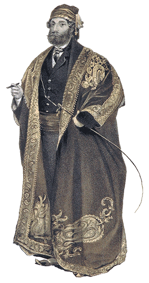

# Dragoman


> A dragoman was an interpreter, translator, and official guide between Turkish, Arabic, and Persian-speaking countries and polities of the Middle East and European embassies, consulates, vice-consulates and trading posts. A dragoman had to have a knowledge of Arabic, Persian, Turkish, and European languages. (Source: wikipedia)

A consistant and pythonic way to handle different datasaets and translations between them.
A dataset can be a simple pandas datafrane or other colum/row data, or it can be data on a grid.

The key feature of dragoman is seamless translations from data represenation into any other. See `notebooks/example.ipynb`

Convenience `pyplot` plotting functions are also defined, in order to produce standard plots without the hassle of figuring out the correct input to the standard matplotlib functions.

## Installation

* `git clone git@github.com:philippeller/dragoman.git`
* `pip install dragoman`

# Intro

Different data representations are available, one being the `GridArray`:
```python
import dragoman as pn

a = dm.GridArray(np.random.rand(100).reshape(20, 5))
a
```
<table><tbody><tr><td><b>y\x</b></td><td><b>0</b></td><td><b>1</b></td><td><b>2</b></td><td><b>3</b></td><td><b>4</b></td><td><b>5</b></td><td>...</td><td><b>14</b></td><td><b>15</b></td><td><b>16</b></td><td><b>17</b></td><td><b>18</b></td><td><b>19</b></td></tr><tr><td><b>0</b>    </td><td>0.279   </td><td>0.426   </td><td>0.353   </td><td>0.315   </td><td>0.446   </td><td>0.0913  </td><td>...</td><td>0.712    </td><td>0.564    </td><td>0.24     </td><td>0.925    </td><td>0.00417  </td><td>0.463    </td></tr><tr><td><b>1</b>    </td><td>0.417   </td><td>0.74    </td><td>0.267   </td><td>0.473   </td><td>0.103   </td><td>0.885   </td><td>...</td><td>0.743    </td><td>0.991    </td><td>0.833    </td><td>0.223    </td><td>0.0862   </td><td>0.3      </td></tr><tr><td><b>2</b>    </td><td>0.918   </td><td>0.752   </td><td>0.689   </td><td>0.876   </td><td>0.957   </td><td>0.931   </td><td>...</td><td>0.759    </td><td>0.919    </td><td>0.9      </td><td>0.498    </td><td>0.644    </td><td>0.834    </td></tr><tr><td><b>3</b>    </td><td>0.836   </td><td>0.626   </td><td>0.737   </td><td>0.584   </td><td>0.33    </td><td>0.414   </td><td>...</td><td>0.874    </td><td>0.203    </td><td>0.299    </td><td>0.0643   </td><td>0.372    </td><td>0.604    </td></tr>
  <tr><td><b>4</b>    </td><td>0.896   </td><td>0.494   </td><td>0.489   </td><td>0.0502  </td><td>0.295   </td><td>0.767   </td><td>...</td><td>0.388    </td><td>0.964    </td><td>0.802    </td><td>0.385    </td><td>0.0112   </td><td>0.522    </td></tr></tbody></table>

that supports many numpy features, for example: 

```python
np.sum(a, axis='x')
```
<table>
  <tbody>
    <tr><td><b>y</b></td><td><b>0</b></td><td><b>1</b></td><td><b>2</b></td><td><b>3</b></td><td><b>4</b></td></tr>
    <tr><td><b></b> </td><td>9.22    </td><td>11.3    </td><td>13.7    </td><td>10.9    </td><td>9.2     </td></tr>
  </tbody>
</table>

```python
np.ones_like(a)
a[a > 0.5] = 0.5
a.T
a[::-2, [1,3,5]]
np.sin(a) / np.abs(2.3 + a**2)
```
Its `grid` attribute is another object, here it was just instantiated with default values (i.e. axis "x" and "y" with points `[0, 1, 2, ...]`), but one can explicitly specify the axes with points and/or edges etc to be used.

The various objects include:
* `GridArray` : holds a single gridded array with corresponding axes
* `GridData` : a collection (container class) of `GridArray`s that share a common grid
* `PointArray` : a single point-like array (like any old np.ndarray)
* `PointData` : collection of same length `PointArray`s (similar to a pandas DataFrame)
* `Grid` : a grid holding several `Axis`
* `Axis` : a 1-d axis of a grid
* `Edges` : binning edges

## Translation methods

One of the stregth are the avilable translation methods, e.g.

```python

p = dm.PointData(x = [1, 2, 6, 7.33, ...], a = [55, 1e6, 3, 3.3, ...])
h = p.histogram(x = 10)
```
or
```python
g = p.interp(x = np.linspace(0,10,1000))
```
etc.

currently there are the follwoing translations methods:
* histogram : Nd (weighted) histograms supporting multi-dimensional elements
* binswise : Nd binwise application of arbitrary functions
* interp : Nd interpolation
* kde : Nd kernel density estimates evaluated on regular grids (variable bandwidth for 1d)
* lookup : Nd lookup of values on grids
* resample : Nd resampling between different grids

## Other things

Objects provide matplotlib plotting methods and jupyterlab HTML output for convenience.

```python
a.plot()
```
